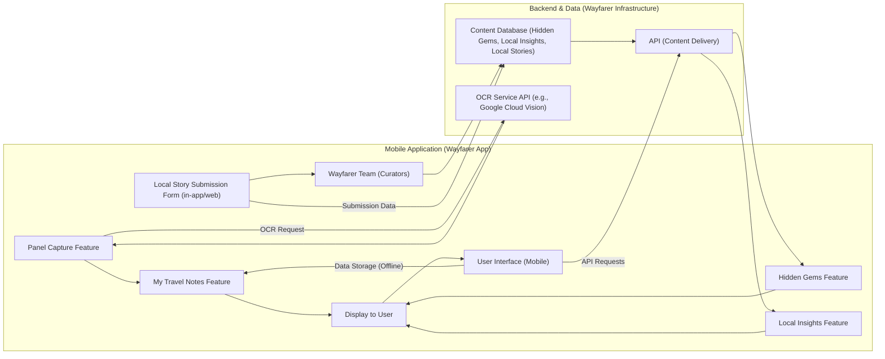
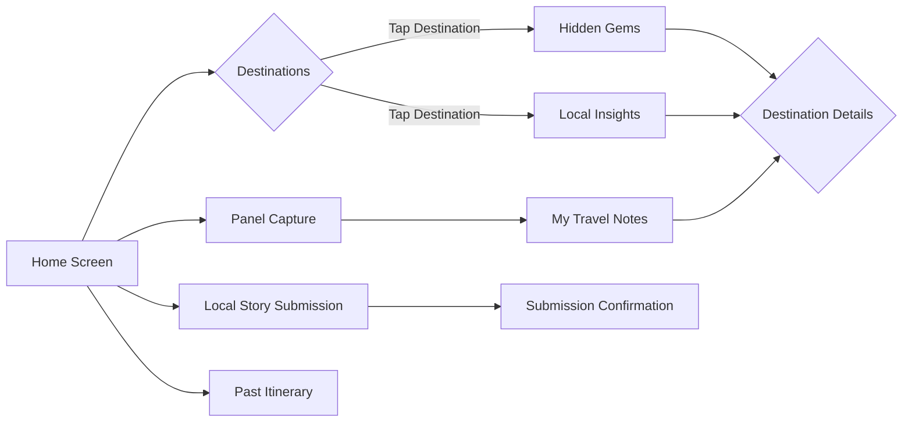

Okay, here is a full architecture document for Wayfarer, incorporating the WHY, HOW, WHAT, user personas, feature sets, and user stories as requested.

---

## Wayfarer Application Architecture Document

**Version:** 1.0 (MVP)
**Date:** October 26, 2023

### 1. Introduction: The Golden Circle - WHY, HOW, WHAT

This document outlines the architecture of Wayfarer, a mobile application designed to transform travel into a more meaningful and culturally enriching experience. We will use the "Golden Circle" framework to define the core principles guiding the application's design and development.

**1.1. WHY: Our Purpose - Believing in Meaningful Travel**

* **Our Core Belief:** We believe travel is more than just sightseeing; it's about understanding, connecting, and enriching both the traveler and the communities they visit. We believe in fostering deeper cultural understanding, respect, and connection through travel experiences.
* **The Problem We Address:**  Current travel solutions often fall short in providing:
    * **Deep Learning and Retention:**  Travelers struggle to absorb and retain information at cultural sites, leading to superficial experiences.
    * **Authentic Cultural Immersion:**  Genuine cultural experiences beyond tourist traps are difficult to find, especially in less-visited destinations.
    * **Empowerment of Local Voices:**  Local experts lack platforms to share their cultural knowledge and benefit from tourism sustainably.
* **Wayfarer Purpose:** To empower culturally conscious travelers to explore destinations more deeply, connect authentically with local cultures, and learn in a more engaging and meaningful way.  We aim to bridge the gap between travelers and local communities, fostering mutual understanding and respect.

**1.2. HOW: Our Approach - User-Centric, Curated, and Accessible**

To achieve our purpose, Wayfarer is built upon the following key principles:

* **User-Centric Design:**  We prioritize the needs and pain points of our target users (Emily, Ben, Carlos) in every design and development decision. Features are designed to be intuitive, efficient, and directly address user needs.
* **Curated & High-Quality Content:** We focus on providing curated, reliable, and high-quality content, including:
    * **"Hidden Gems" and "Cultural Deep Dives":**  Carefully selected and vetted to ensure authenticity and depth.
    * **"Local Insights":**  Connecting users with knowledgeable and passionate local experts.
    * **"Local Stories":**  Empowering local voices and ensuring content is culturally relevant and respectful.
* **Offline Accessibility:** Recognizing that internet connectivity can be unreliable during travel, core features like "My Travel Notes," "Hidden Gems," and "Local Insights" are designed for offline access.
* **Technology for Empowerment:** We leverage technology like OCR, location services, and potentially future AI (summarization) to enhance user experience and provide valuable tools for learning and discovery.
* **Sustainable & Responsible Tourism Focus:**  By connecting travelers with local communities and promoting authentic experiences, we aim to contribute to more sustainable and responsible tourism practices.

**1.3. WHAT: Our Product - Wayfarer Mobile Application (MVP)**

Wayfarer is a mobile application (MVP focused initially on iOS and Android) featuring the following core functionalities designed to deliver on our WHY and HOW:

* **For Emily, the Detail-Oriented Explorer:**
    * **Panel Capture:**  Effortlessly capture information from museum and site panels using the device camera, including text extraction (OCR) and image capture.
    * **My Travel Notes:**  A personal digital journal for storing captured panels, text notes, and organizing learning experiences by location and date, with basic keyword search.
    * **Past Itinerary:** Upload photos, extract GPS location data, and plot these on a map to visualize past trips.

* **For Ben, the Off-the-Beaten-Path Seeker:**
    * **Hidden Gems:**  Curated lists of less-known attractions and authentic experiences for select destinations, including descriptions, photos, and map locations.
    * **Local Insights:**  A basic directory of local contacts with areas of expertise for select destinations, facilitating connections for personalized insights.

* **For Carlos, the Local Storyteller:**
    * **Local Story Submission:** A form for locals to submit their cultural stories and insights for review and potential curation into the app's content (initially managed by the Wayfarer team).

These MVP features are designed to be the foundation upon which we will build a richer and more comprehensive travel experience in future iterations.

### 2. User Personas - Driving Feature Development

Wayfarer is designed with the following Tier 1 user personas at its core:

**2.1. Emily, the Detail-Oriented Explorer:**

* **Needs:**  Efficiently capture and organize detailed information at museums and cultural sites. Revisit and learn from this information later. Minimize information overload and maximize learning during visits.
* **Pains:** Information overload, difficulty capturing notes effectively, forgetting details, feeling rushed, lack of personalized learning tools.
* **Gains:** Deep understanding of visited places, organized knowledge, ability to revisit and share learnings, feeling accomplished and informed.
* **Jobs To Be Done:** Capture and organize information from panels, create a personal learning record, access detailed exhibit information, plan visits for maximum learning.

**2.2. Ben, the Off-the-Beaten-Path Seeker:**

* **Needs:** Discover authentic cultural experiences beyond tourist traps. Access reliable cultural information for less-visited destinations. Connect with local perspectives and insights.
* **Pains:** Difficulty finding authentic experiences, lack of reliable information for off-the-beaten-path locations, superficial tourist offerings, fear of missing out on real culture.
* **Gains:** Discovering hidden gems, connecting with locals, deeper cultural appreciation, authentic and unique travel experiences, feeling adventurous and informed.
* **Jobs To Be Done:** Find reliable cultural information for less-visited places, connect with locals, discover hidden attractions, plan authentic cultural experiences.

**2.3. Carlos, the Local Storyteller:**

* **Needs:** A platform to share his cultural knowledge and passion with travelers. Connect with a global audience interested in authentic experiences. Contribute to his community through tourism.
* **Pains:** Lack of platform to reach tourists, difficulty showcasing in-depth cultural content, limited opportunities to connect with travelers, concerns about misrepresentation of his culture.
* **Gains:** Sharing his culture, connecting with people worldwide, contributing to a positive image of his community, building a reputation as a cultural expert, preserving his heritage.
* **Jobs To Be Done:** Create and share engaging cultural content, connect with interested travelers, offer cultural experiences (future), build a sustainable business around his culture (future).

### 3. Feature Sets and User Stories

This section details the feature sets within Wayfarer MVP, outlining key features and associated user stories from the perspective of our personas.

**3.1. Feature Set: Content Capture & Organization (For Emily)**

* **Key Features:**
    * **Panel Capture:** Camera-based capture of exhibit panels with OCR text extraction and image saving.
    * **My Travel Notes:**  Location-based digital notes for storing captured panels and text notes, with basic search and organization.
    * **Past Itinerary:** Upload photos, extract GPS location data, and plot these on a map to visualize past trips.

* **User Stories:**

    * **As Emily,** when I am at a museum exhibit with a lot of text panels, **I want to use "Panel Capture" to quickly take a photo and extract the text**, so I don't have to spend time writing everything down manually.
    * **As Emily,** after capturing a panel, **I want to be able to review and edit the extracted text**, so I can correct any OCR errors and ensure accuracy.
    * **As Emily,** **I want "Panel Capture" to automatically save the image and extracted text into "My Travel Notes"**, so I can keep all my learning materials organized in one place.
    * **As Emily,** in "My Travel Notes," **I want to be able to create new text notes in addition to captured panels**, so I can add my own thoughts, reflections, and additional information.
    * **As Emily,** **I want "My Travel Notes" to organize my notes by location and date**, so I can easily find notes from specific places and time periods.
    * **As Emily,** **I want to be able to search my "My Travel Notes" by keywords**, so I can quickly find information on specific topics I learned about during my travels.
    * **As Emily,** when visiting a museum with poor internet connectivity, **I need "Panel Capture" and "My Travel Notes" to work offline**, so I can still capture information and access my notes without interruption.
    * **As Emily,** after a trip, **I want to upload photos from my camera roll to the "Past Itinerary" feature**, so I can visualize my journey on a map.
    * **As Emily,** **I want the app to automatically extract GPS location data from my photos and plot them on a map in "Past Itinerary"**, so I can see where I took each photo.
    * **As Emily,** **I want to be able to add notes and descriptions to each photo in "Past Itinerary"**, so I can remember the context and details of each moment.
    * **As Emily,** **I want to be able to view my "Past Itinerary" as a timeline or a map**, so I can easily recount my trip and see the route I took.

**3.2. Feature Set: Authentic Cultural Immersion (For Ben)**

* **Key Features:**
    * **Hidden Gems:** Curated lists of off-the-beaten-path attractions and experiences for select destinations.
    * **Local Insights:** Basic directory of local contacts with expertise in specific cultural areas for select destinations.

* **User Stories:**

    * **As Ben,** when planning a trip to Kyoto, **I want to use the "Hidden Gems" feature to discover less-touristy attractions and experiences**, so I can go beyond the typical tourist sights and find more authentic cultural encounters.
    * **As Ben,** when browsing "Hidden Gems," **I want to see descriptions, photos, and map locations for each place**, so I can understand what it is and how to get there.
    * **As Ben,** for each "Hidden Gem," **I want to see a category tag (e.g., "Local Market," "Historical Site")**, so I can easily filter and find places that match my interests.
    * **As Ben,** when researching a destination, **I want to use "Local Insights" to find local experts in areas like food or history**, so I can potentially get insider tips and recommendations.
    * **As Ben,** when viewing a "Local Insight" contact, **I want to see their area of expertise and a brief bio**, so I can understand their background and relevance to my interests.
    * **As Ben,** **I want a way to contact the "Local Insight" contacts (even if it's just a contact form or email link) directly through the app**, so I can reach out and ask questions or inquire about personalized experiences.
    * **As Ben,** when traveling in areas with limited internet access, **I need "Hidden Gems" and "Local Insights" data to be available offline for the destinations I'm visiting**, so I can access this information even without a connection.

**3.3. Feature Set: Local Storytelling Contribution (For Carlos)**

* **Key Features:**
    * **Local Story Submission Form:** A form for locals to submit cultural stories and insights to the Wayfarer team.

* **User Stories:**

    * **As Carlos,** **I want a simple way to submit my stories and cultural knowledge to Wayfarer through a submission form**, so I can share my insights with travelers using the app.
    * **As Carlos,** when submitting a story, **I want to be able to include text content, photos, location tags, and language information**, so I can provide rich and contextually relevant information.
    * **As Carlos,** after submitting my story, **I want to receive confirmation that it has been received for review**, so I know my contribution is being considered.
    * **As Carlos,** **I understand that my submitted stories will be reviewed and curated by the Wayfarer team before being potentially published in the app**, ensuring quality and relevance for users.
    * **As Carlos,** **I hope that my stories, if selected, will be featured in "Hidden Gems" or "Cultural Deep Dives" sections of Wayfarer**, so they can reach a wide audience of travelers interested in authentic cultural experiences.

### 4. Key Features Summary Table

| Feature Name         | Description                                                                 | Target Persona(s) | Key Benefit                                                               |
|----------------------|-----------------------------------------------------------------------------|--------------------|---------------------------------------------------------------------------|
| **Panel Capture**    | Camera-based capture & OCR of exhibit panels                                 | Emily              | Effortless information capture, reduces note-taking burden                 |
| **My Travel Notes**  | Location-based digital journal for notes and captured panels                 | Emily              | Organized learning, easy information retrieval, offline access           |
| **Past Itinerary**   | Upload photos, extract GPS, plot on map                                     | Emily              | Visualize past trips, recount journey, remember details                   |
| **Hidden Gems**      | Curated lists of off-the-beaten-path attractions for select destinations       | Ben                | Discovery of authentic experiences, beyond tourist traps                   |
| **Local Insights**   | Basic directory of local experts for select destinations                       | Ben                | Connection with local perspectives, insider knowledge access             |
| **Local Story Submission** | Form for locals to submit cultural stories for curation and potential publication | Carlos             | Platform to share cultural knowledge, reach a global travel audience      |

### 5. Conceptual Architecture Diagram (MVP)

**Diagram Explanation:**

* **Mobile Application (Wayfarer App):** Represents the user-facing mobile application.
    * **Features:**  Highlights the core MVP features: Panel Capture, My Travel Notes, Hidden Gems, Local Insights, and Local Story Submission.
    * **User Interface (Mobile):**  The visual interface through which users interact with the app.
    * **Data Storage (Offline):**  Indicates local storage for "My Travel Notes" to enable offline access.
    * **API Requests:** The mobile app communicates with the Backend API to fetch content.

* **Backend & Data (Wayfarer Infrastructure):** Represents the server-side components.
    * **Content Database:** Stores curated content for "Hidden Gems," "Local Insights," and submitted "Local Stories."
    * **API (Content Delivery):**  Provides an API for the mobile app to access and retrieve content from the database.
    * **Wayfarer Team (Curators):** Represents the team responsible for reviewing and curating "Local Story" submissions and managing content.
    * **OCR Service API:**  External API (e.g., Google Cloud Vision) used for Optical Character Recognition in the "Panel Capture" feature.

* **Data Flow:** Arrows indicate the flow of data and interactions between components.
    * User interactions within the mobile app trigger feature functionalities.
    * The mobile app requests content from the Backend API.
    * The Backend API retrieves data from the Content Database.
    * "Panel Capture" utilizes an external OCR API.
    * Local Story submissions are processed by the Wayfarer team and stored in the Content Database.

### 6. Information Architecture Diagram

### 7. Future Enhancements (Post-MVP Roadmap)

Following the MVP release, we plan to expand Wayfarer with the following features and enhancements, based on user feedback and evolving needs:

* **AI-Powered Summarization:**  Implement AI-based summarization for captured panels and notes.
* **Advanced "My Travel Notes":**  Add audio/video notes, advanced tagging, timeline view, sharing capabilities.
* **Full "Local Insights" Platform:**  Develop robust profiles for locals, in-app messaging, user reviews and ratings, verification system for Wayfarer.
* **Advanced "Hidden Gems":**  User-generated reviews and ratings, more detailed filtering options, saving to itinerary, expanded location coverage.
* **Full "Local Stories" Platform:**  User profiles for locals, content management dashboard for locals, user interaction features (comments, questions).
* **Past Itinerary Enhancements:**  Integration with social media, advanced map views, trip sharing capabilities.
* **Cultural Deep Dives:**  Expand content to include in-depth articles, videos, and interactive content on local cultures.
* **Multilingual Content & Interface:**  Implement automated translation for content and localize the app interface for multiple languages.
* **Booking & Payments:** Integrate booking and payment functionality for local tours and experiences offered through the platform.
* **Personalized Recommendations:** Develop personalized recommendations for "Hidden Gems," "Local Insights," and "Cultural Deep Dives" based on user interests and travel history.

This architecture document provides a comprehensive overview of the Wayfarer application for its MVP release. It serves as a guide for development, design, and communication, ensuring a user-centric and purpose-driven approach to building a truly meaningful travel experience.

---
