# Travel App - Personas and User Journeys

This document outlines the detailed personas and user journeys for the travel application.

## I. Personas

# Travel App - Personas

This document outlines the detailed personas for the travel application.

## I. Personas

### 1. Emily, the Detail-Orient Explorer

*   **Description:** Loves to absorb every bit of information at museums and historical sites. Wants to capture and revisit information panels easily, maximizing learning and minimizing regret.
*   **Pains:** Information overload at museums/sites; Difficulty capturing and organizing information from panels; Forgetting details later; Missing out on key information due to time constraints or distractions; Feeling rushed when traveling with others.
*   **Gains:** Deep understanding of the places she visits; Ability to revisit and share information later; Feeling of accomplishment and maximizing the value of her experiences; Enhanced learning and retention of information; Ability to travel at her own pace.
*   **Jobs To Be Done:** Capture and organize information from interpretive panels easily; Access detailed information about exhibits and artifacts; Create a personal record of her learning experiences; Share her knowledge and insights with others; Plan her visits to maximize learning and minimize FOMO.

### 2. Ben, the Off-the-Beaten-Path Seeker

*   **Description:** Ventures to less-traveled destinations and struggles to find reliable cultural information. Desires a way to connect with local insights and understand cultural nuances.
*   **Pains:** Difficulty finding reliable cultural information in less-touristed destinations; Lack of access to local insights and perspectives; Expensive or superficial tour options; Fear of missing out on authentic cultural experiences; Language barriers and communication challenges.
*   **Gains:** Discovering hidden gems and unique cultural experiences; Connecting with locals and understanding their way of life; Gaining a deeper appreciation for different cultures; Feeling a sense of adventure and discovery; Avoiding tourist traps and having more authentic travel experiences.
*   **Jobs To Be Done:** Find reliable and in-depth cultural information about less-visited destinations; Connect with locals and learn about their customs and traditions; Discover off-the-beaten-path attractions and activities; Plan authentic and immersive cultural experiences; Overcome language barriers and communicate effectively with locals.

### 3. Carlos, the Local Storyteller

*   **Description:** Passionate about sharing the history and culture of his region. Wants a platform to connect with tourists and share his knowledge in multiple languages.
*   **Pains:** Lack of a platform to share his knowledge and passion for his culture; Difficulty reaching a foreign audience; Frustration with unreliable tour bookings and no-shows; Limited opportunities to connect with tourists and share his insights; Concerns about cultural misinterpretations or misrepresentations.
*   **Gains:** Sharing his love for his culture and contributing to a positive image of his community; Connecting with people from around the world and fostering cultural exchange; Generating income from his knowledge and passion; Building a reputation as a cultural expert and ambassador; Preserving and promoting his cultural heritage.
*   **Jobs To Be Done:** Create and share engaging content about his culture in multiple languages; Connect with tourists interested in authentic cultural experiences; Offer tours and experiences that showcase the best of his community; Build a sustainable business based on his cultural knowledge; Ensure accurate and respectful representation of his culture.

### 4. Alice, the Urban Explorer

*   **Description:** Prefers to explore cities on foot, immersing herself in the local atmosphere. Finds it challenging to navigate unfamiliar streets and discover interesting points of interest along the way, especially when signage is poor. Values walking tours but prefers the flexibility of exploring at her own pace.
*   **Pains:** Difficulty navigating unfamiliar city streets; Missing interesting sights due to poor signage or lack of information; Frustration with bulky guidebooks or inflexible walking tours; Desire for a more immersive and personalized walking experience.
*   **Gains:** Freedom to explore cities at her own pace; Discovery of hidden gems and local points of interest; Deeper connection with the city's atmosphere and culture; Enhanced sense of adventure and discovery.
*   **Jobs To Be Done:** Easily plan and follow walking routes in unfamiliar cities; Discover interesting points of interest along the way; Receive turn-by-turn directions and navigation assistance; Explore cities at her own pace and customize her walking experience; Learn about the history and culture of the places she visits while walking.

### 5. David, the Future Self Sharer

*   **Description:** Documents travel experiences meticulously, aiming to create a rich record for future reflection. Desires a way to easily access and share these documented learnings with his future self.
*   **Pains:** Difficulty organizing and revisiting travel photos, videos, and notes; Forgetting details and context over time; Lack of a centralized platform for storing and reflecting on travel memories.
*   **Gains:** A comprehensive and easily searchable archive of travel experiences; Ability to relive past trips and share memories with loved ones; Enhanced sense of personal growth and reflection through revisiting past journeys.
*   **Jobs To Be Done:** Capture and store travel memories in a structured and accessible format; Easily search and retrieve specific travel moments; Share travel logs and insights with future self and others; Reflect on past experiences and gain new perspectives.

### 6. Sarah, the Efficiency Maximizer

*   **Description:** Values time and wants to quickly identify must-see sights and key information at destinations. Seeks a way to filter through the noise and prioritize experiences.
*   **Pains:** Overwhelmed by the abundance of information at destinations; Difficulty identifying the most important sights and experiences; Wasting time researching and planning itineraries; Fear of missing out on must-see attractions.
*   **Gains:** Time-saving access to curated highlights and essential information; Ability to quickly prioritize experiences and create efficient itineraries; Reduced stress and increased enjoyment of travel.
*   **Jobs To Be Done:** Quickly identify must-see attractions and key information at destinations; Easily plan efficient itineraries based on interests and available time; Access curated recommendations from experts and other travelers; Minimize research time and maximize travel experience.

### 7. Maria, the History Buff

*   **Description:** Passionate about learning the history and culture of the places she visits. Wants to easily access in-depth information and share it with others.
*   **Pains:** Difficulty finding reliable and in-depth historical information; Limited access to local historical perspectives; Frustration with superficial tourist information; Desire to share historical insights with others.
*   **Gains:** Deep understanding of the history and culture of visited locations; Access to curated and reliable historical information; Ability to connect with local historians and cultural experts; Opportunity to share historical insights with others.
*   **Jobs To Be Done:** Access detailed historical information about destinations; Connect with local historians and cultural experts; Share historical insights and discoveries with others; Preserve and promote historical knowledge.

### 8. Lisa, the Language Bridge

*   **Description:** Wants to connect with and learn from locals but faces language barriers. Seeks a tool to translate and access information in different languages.
*   **Pains:** Difficulty communicating with locals due to language differences; Limited access to information in local languages; Frustration with translation apps that lack nuance or accuracy; Missed opportunities for cultural exchange due to language barriers.
*   **Gains:** Ability to communicate effectively with locals; Access to information and cultural insights in multiple languages; Enhanced cultural exchange and understanding; More immersive and meaningful travel experiences.
*   **Jobs To Be Done:** Translate text and conversations in real-time; Access information and content in different languages; Learn basic phrases and vocabulary in local languages; Connect with locals and overcome language barriers.

### 9. Alex, the Day-by-Day Planner

*   **Description:** Prefers to plan itineraries on the fly and needs quick access to relevant information. Wants to discover hidden gems and local recommendations.
*   **Pains:** Overwhelmed by extensive pre-planning; Difficulty finding relevant information on the go; Fear of missing out on hidden gems and local experiences; Desire for flexible and spontaneous travel planning.
*   **Gains:** Ability to plan itineraries quickly and easily; Access to real-time information and local recommendations; Discovery of hidden gems and unique experiences; Increased flexibility and spontaneity in travel planning.
*   **Jobs To Be Done:** Quickly access relevant information and recommendations on the go; Easily create and modify itineraries based on real-time information; Discover hidden gems and local experiences; Plan flexible and spontaneous trips.

### 10. Jessica, the Highlight Seeker

*   **Description:** Often overwhelmed by the amount of information available at destinations. Wants a way to quickly identify the most important things to see and do.
*   **Pains:** Information overload and difficulty prioritizing; Wasting time researching and sifting through irrelevant content; Fear of missing out on the most important attractions; Desire for concise and curated recommendations.
*   **Gains:** Time-saving access to curated highlights and essential information; Ability to quickly identify must-see attractions and experiences; Reduced stress and increased efficiency in travel planning.
*   **Jobs To Be Done:** Quickly identify the most important things to see and do at destinations; Access curated recommendations and highlights from experts and other travelers; Efficiently plan itineraries and prioritize experiences.

### 11. Kevin, the Guided Wanderer

*   **Description:** Enjoys the structure of a guided tour but prefers flexibility. Seeks an app that provides the benefits of a tour guide without the rigid schedule.
*   **Pains:** Inflexible schedules and fixed itineraries of traditional guided tours; High cost of private tours; Difficulty finding tours that cater to specific interests; Desire for a more personalized and flexible guided experience.
*   **Gains:** Access to expert information and guided experiences at their own pace; Cost-effective alternative to traditional guided tours; Flexibility to explore at their own leisure and customize their experience.
*   **Jobs To Be Done:** Access guided tours and expert information at their own pace; Explore destinations with the help of curated content and audio guides; Customize guided experiences based on their interests and preferences.

### 12. Amy, the Value-Conscious Explorer

*   **Description:** Wants to maximize her travel experience while minimizing costs. Seeks free or affordable resources for information and guidance.
*   **Pains:** Limited budget for travel resources and guided tours; Difficulty finding free and reliable information; Concern about hidden costs and tourist traps; Desire to maximize value and minimize expenses.
*   **Gains:** Access to free or affordable travel information and resources; Ability to plan budget-friendly itineraries and experiences; Discovery of cost-effective travel options and deals.
*   **Jobs To Be Done:** Find free or affordable travel information and resources; Plan budget-friendly itineraries and activities; Discover cost-effective travel options and deals; Maximize travel experience while minimizing expenses.

### 13. Tom, the DIY Enthusiast

*   **Description:** Prefers to plan his own trips and avoid expensive tours. Looks for tools and resources to enhance his self-guided explorations.
*   **Pains:** Time-consuming research and planning process; Difficulty finding reliable and up-to-date information; Lack of tools to organize and manage self-guided tours; Desire for resources that enhance independent exploration.
*   **Gains:** Ability to plan and execute personalized travel itineraries; Access to tools and resources that support independent exploration; Enhanced sense of adventure and discovery.
*   **Jobs To Be Done:** Plan and organize personalized travel itineraries; Access reliable and up-to-date travel information; Utilize tools to enhance self-guided explorations; Discover hidden gems and local experiences independently.

### 14.  Jessica, the Spontaneity Seeker

*   **Description:** Jessica thrives on spontaneity and prefers to be inspired by her surroundings rather than meticulously planning every detail. She often finds herself with downtime during her travels and wants a way to quickly discover nearby attractions and experiences that align with her interests.
*   **Pains:**  Boredom during downtime or unexpected delays;  Missing out on interesting experiences due to lack of awareness;  Feeling overwhelmed by the abundance of options when searching for things to do;  Difficulty finding activities that match her current mood and interests.
*   **Gains:**  Ability to make the most of her travel time, even during unplanned moments;  Discovery of hidden gems and unique experiences that she might otherwise miss;  Increased excitement and spontaneity in her travels;  A sense of adventure and serendipity.
*   **Jobs To Be Done:** Quickly find nearby attractions and activities based on her current location and interests;  Filter options based on factors like time commitment, cost, and type of experience;  Get inspired by recommendations from locals and other travelers;  Easily incorporate spontaneous activities into her travel plans.

## II. User Journeys

### 1. Content Capture & Organization (Emily)

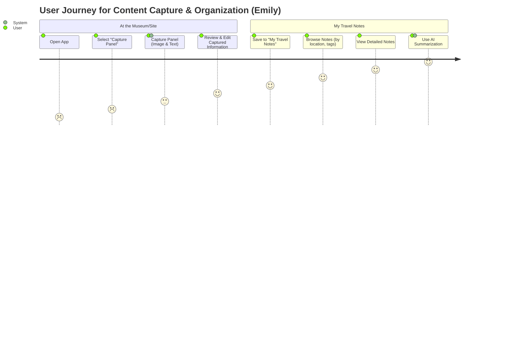

### 2. Cultural Immersion (Ben)

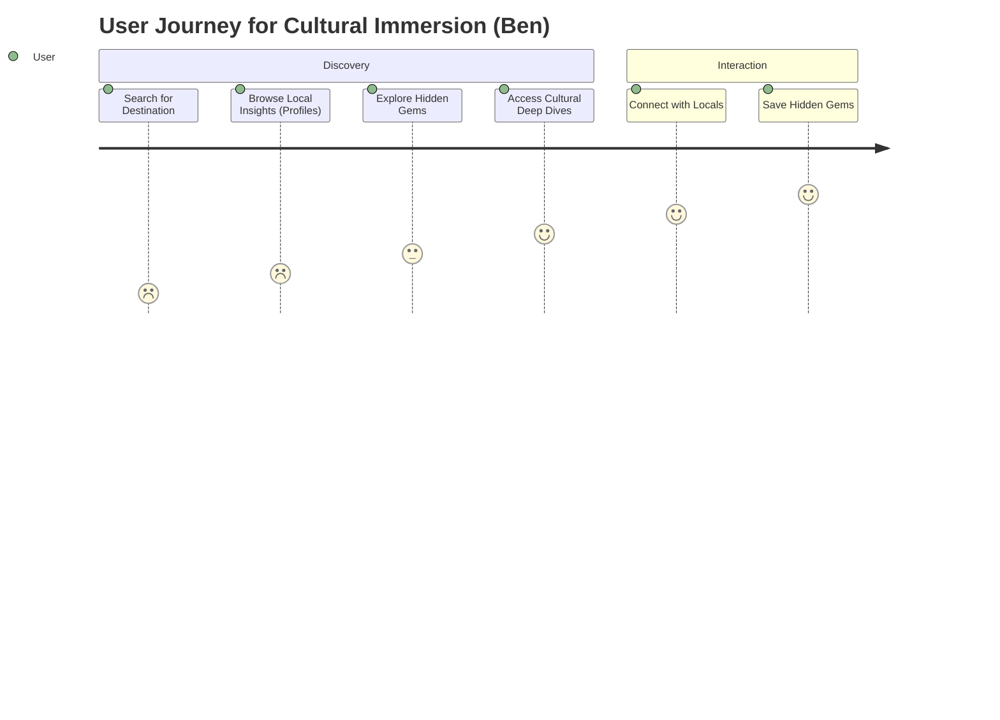

### 3. Smart Walking Routes (Alice)

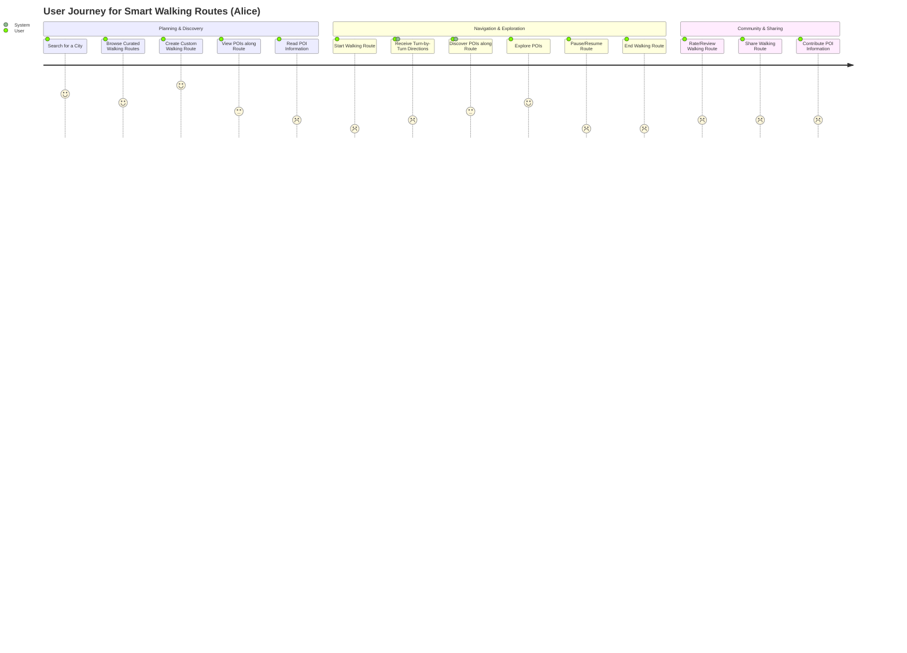

### 4. Local Storytelling Platform (Carlos & Users)

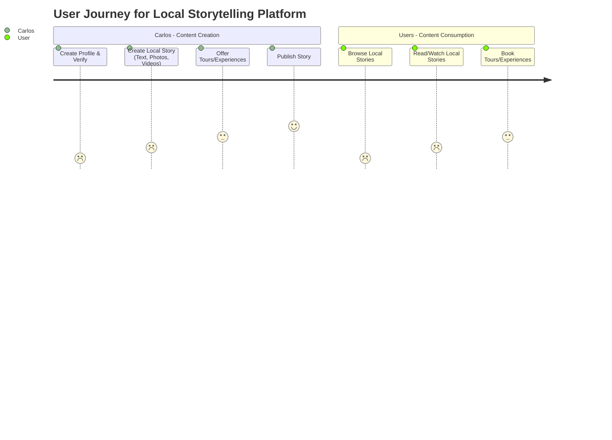

### 5. Booking & Payments

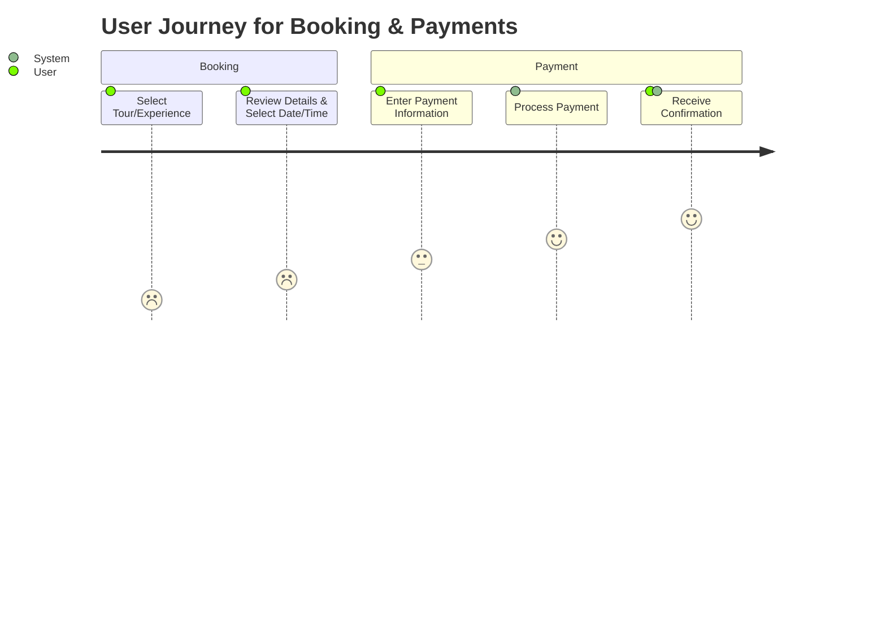

### 6. David, the Future Self Sharer

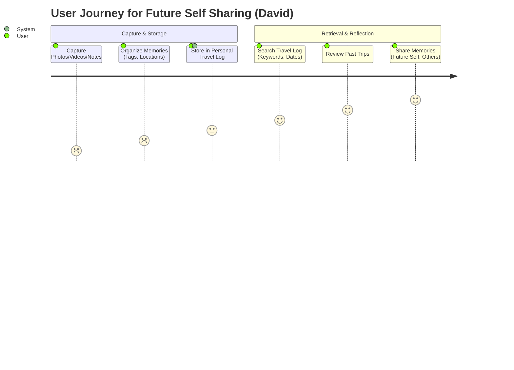

### 7. Sarah, the Efficiency Maximizer

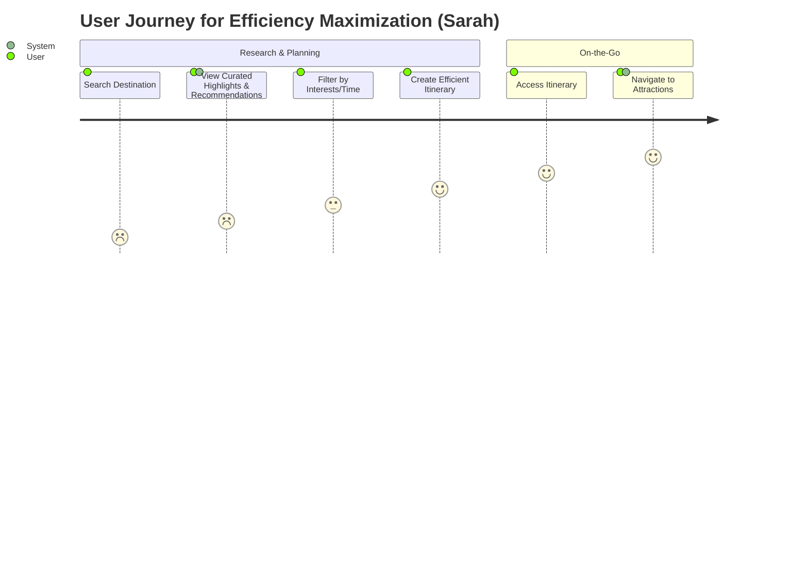

### 8. Maria, the History Buff

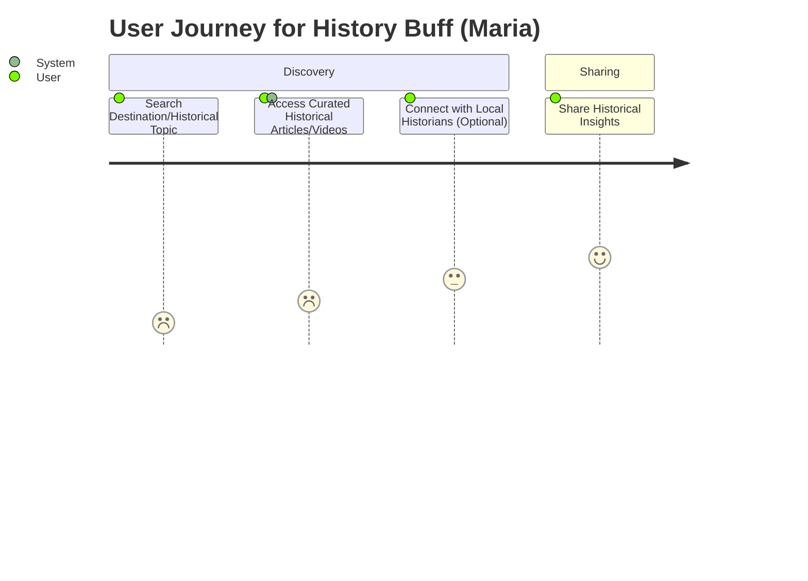

### 9. Lisa, the Language Bridge

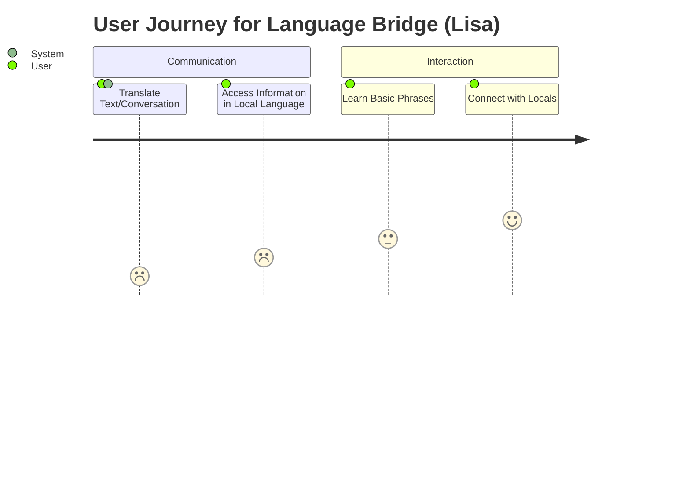

### 10. Alex, the Day-by-Day Planner

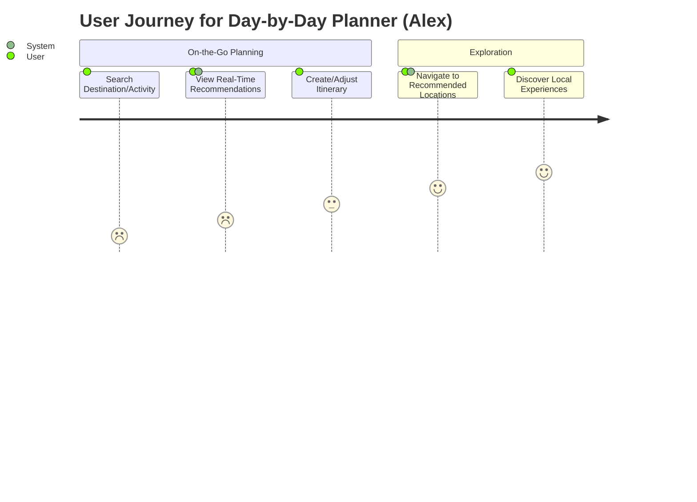

### 11. Jessica, the Highlight Seeker

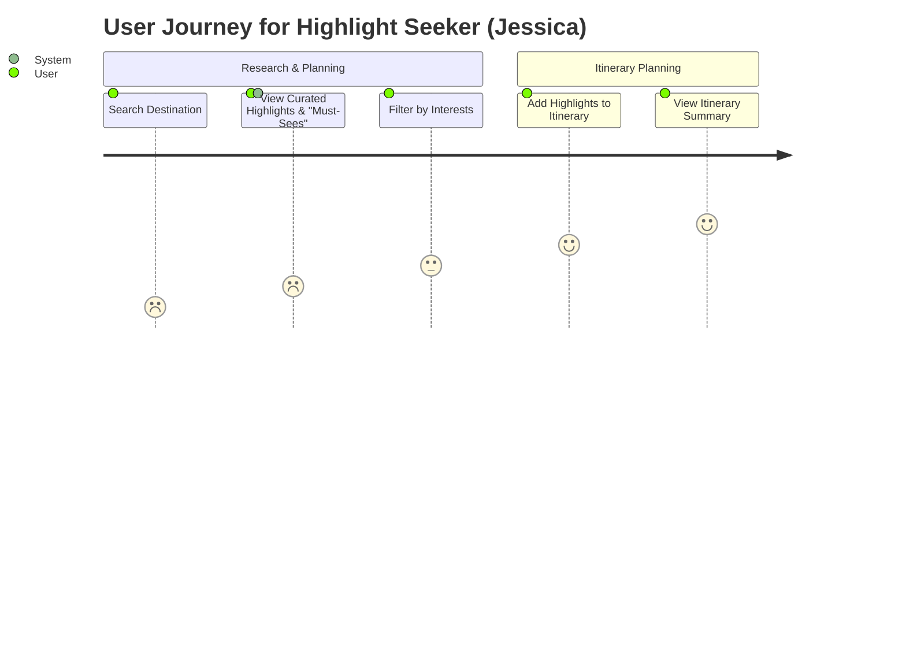

### 12. Kevin, the Guided Wanderer

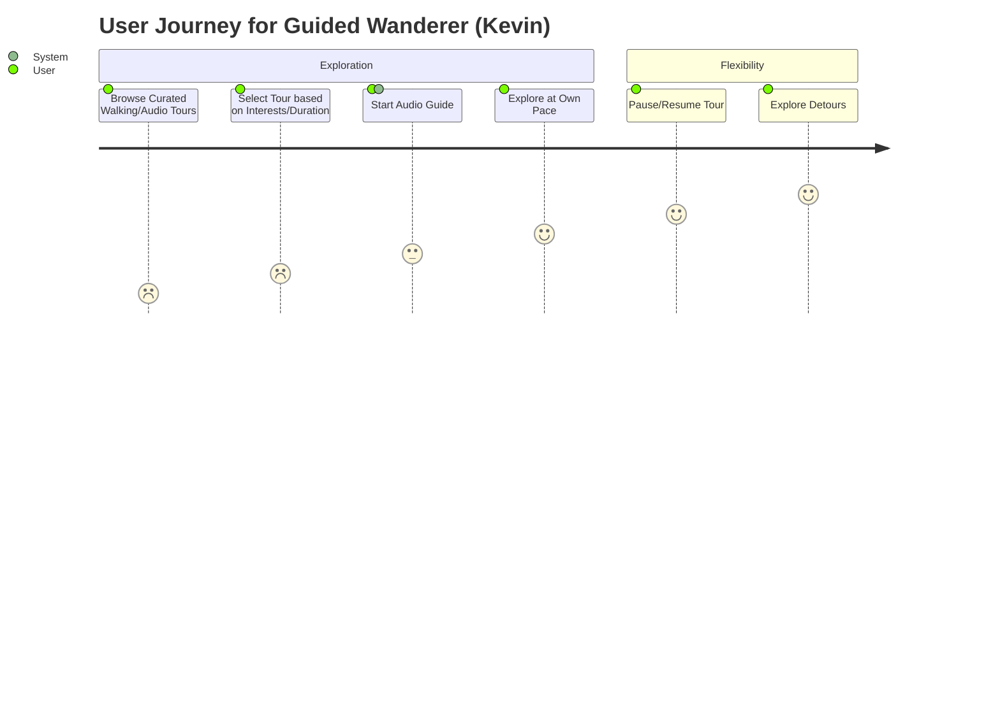

### 13. Amy, the Value-Conscious Explorer

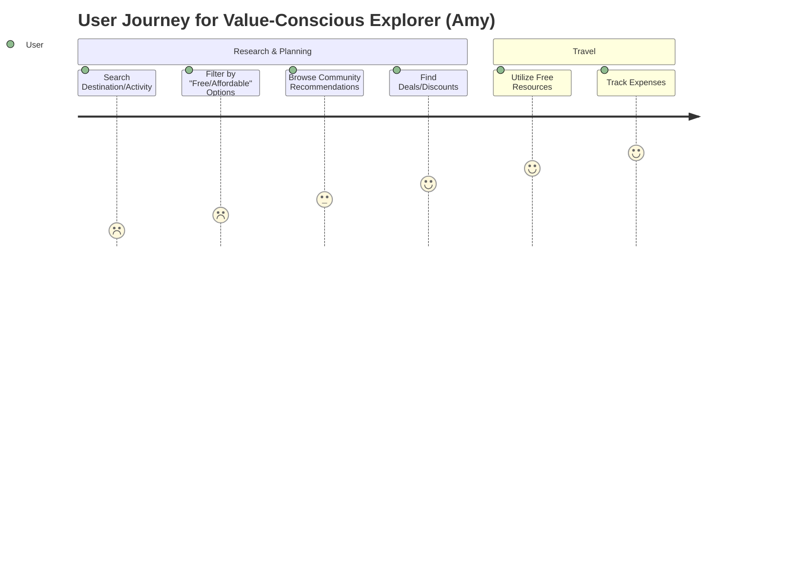

### 14. Tom, the DIY Enthusiast

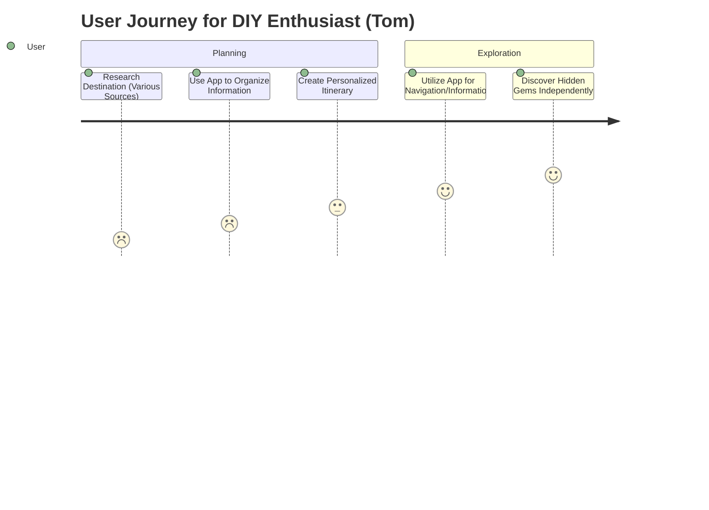

